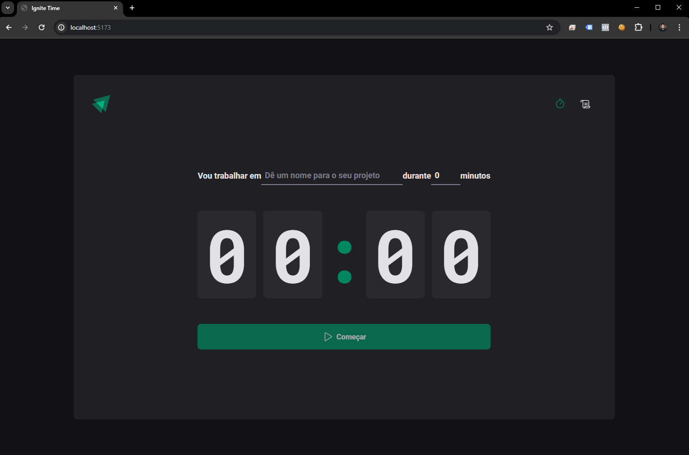
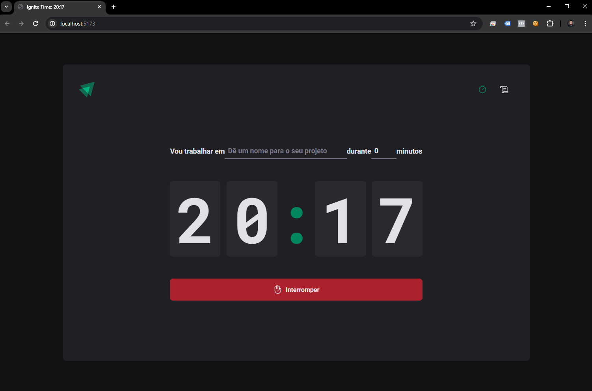
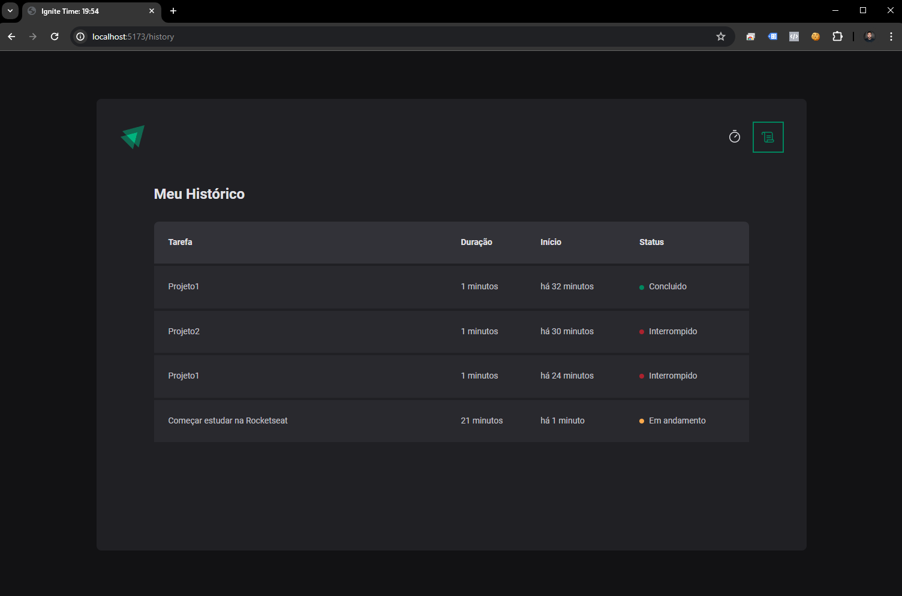

# Meu Projeto

O Pomodoro Timer é um aplicativo inspirado na técnica Pomodoro, que é uma maneira simples de ajudar a gerenciar seu tempo e manter o foco nas tarefas. Com este aplicativo, você divide o seu trabalho em períodos curtos chamados "pomodoros", seguidos por pausas curtas. Essa abordagem pode melhorar a sua produtividade e tornar o trabalho mais eficiente.

## Screenshots

## Funcionalidades

- Configure facilmente o tempo de trabalho e os intervalos de descanso.
- Acompanhe o tempo restante para cada pomodoro e pausa.
- Mantenha um histórico das suas atividades concluídas para acompanhar seu progresso ao longo do tempo.

## Como Usar

Para utilizar este projeto, siga estas etapas:

1. Clone este repositório.
2. Instale as dependências usando `npm install`.
3. Execute o projeto com `npm start`.
4. Interaja com o timer de produtividade e gerencie suas tarefas com facilidade.

## Tecnologias Utilizadas

- React
- React Hook Form
- React Router Dom
- Zod
- Date-fns
- Styled Components
- Zod
- Immer
- E mais...

# IgniteTimer
